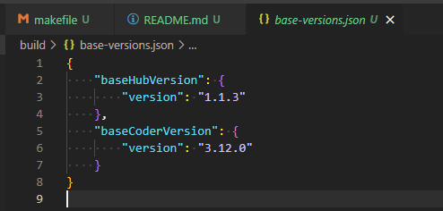

# Code Kitchen - Custom Codespaces

```bash
Maintained by: Daniel OConnor
```

### Description

Code Kitchen is an IDE you can host in your own kubernetes cluster. 

This is based off cdr/coder, and JupyterHub, which when combined give you managed VS Code containers.

The conntainers this repo builds are custom ones I use for myself and my friends.

This repository houses the builds, the related artifacts, and the associated GitHub workflows.

### Builds

[](https://github.com/FoodyFood/code-kitchen-build/actions/workflows/code-kitchen-hub.yaml) \
[](https://github.com/FoodyFood/code-kitchen-build/actions/workflows/code-kitchen-coder.yaml) \
[](https://github.com/FoodyFood/code-kitchen-build/actions/workflows/code-kitchen-coder-learning.yaml) 

### What Does It Make

Whe you run `make all` it will build 3 images, 1 hub, and 2 environments. 

Currently the three environements are
```bash
Cloud and Web Dev Environment - Includes aws-cli, helm, node-shell, kubectl, etc.. (cloud tools)
Web Dev Learning Environment - Includes ruby-full
Standard VS Code Environment - No fancy extras (base image unaltered)
```


### Setting Up Builds

When you clone and push this repo to your GitHub, the flows will be put in place, but you will need to edit them to reflect your own GitHub account info and GHCR.


The builds expect to have the 'base image' in the same GHCR that thwy will use for the builds. There is a script in the build folder to copy them into your ghcr.


Once the builds are triggered, they will produce the 3 images.


The builds will use the base image versions specified in the base-versions.json file. 

If there is a new version of JupyterHub or Coder, you can put them into that file, and trigger some builds. Make sure to have copied the new versions to yor GHCR before you trigger the builds of course.

JupyterHub https://hub.docker.com/r/jupyterhub/k8s-hub/tags
CDR/CodeServer https://github.com/cdr/code-server/releases



